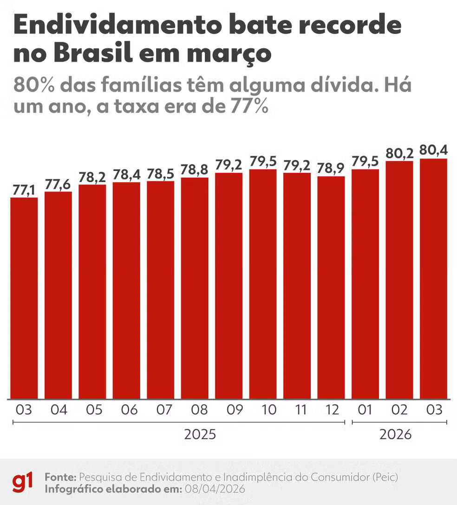

# 02. PROBLEMA E CONTEXTO

## Identificando o problema

Muitas pessoas têm dificuldade para organizar gastos, entender para onde o dinheiro está indo, controlar despesas, avaliar se os gastos são compatíveis com sua realidade e alcançar objetivos financeiros.\
O problema central é que as ferramentas atuais mostram os números, mas nem sempre ajudam o usuário a entender o que fazer com eles.

## Obtendo o contexto

O endividamento das famílias brasileiras vem atingindo níveis elevados. Em março de 2026, 80,4% das famílias estavam endividadas, enquanto 81,7 milhões de brasileiros estavam inadimplentes. A reportagem relaciona esse cenário ao alto custo de vida, às taxas de juros e ao crédito caro, mostrando a dificuldade de muitas pessoas em administrar suas finanças. Esse contexto evidencia a necessidade de ferramentas que não apenas registrem os gastos, mas também ajudem o usuário a compreender sua situação financeira e tomar decisões.

<figure><figcaption>
Imagem mostrando a porcentagem de famílias endividadas de 03/2025 a 03/2026
</figcaption></figure>

Fonte: [Endividamento dos brasileiros pautam eleição 2026 | G1](https://g1.globo.com/politica/eleicoes/2026/noticia/2026/04/10/endividamento-dos-brasileiros-avanca-e-entra-na-agenda-dos-pre-candidatos-na-eleicao-de-2026.ghtml)
