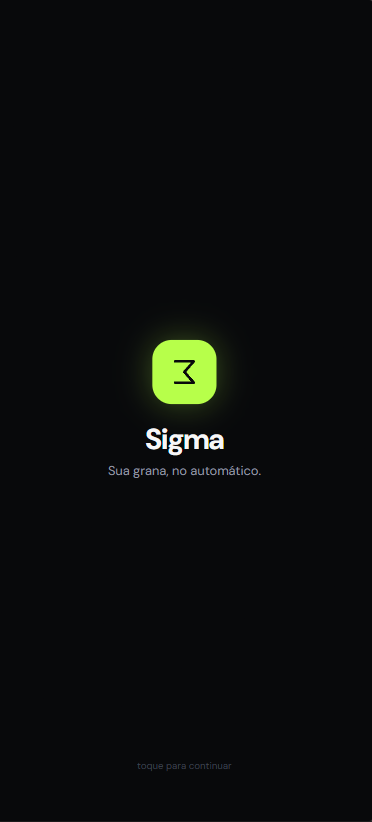

# 08. EXPERIÊNCIA E INTERFACE DO USUÁRIO

Tela Incial -

\
\
\
\
\
\
\
\
\
\
\
\
 

Tela de Introdução -

\
\
\
\
\
\
\
\
\
\
\
\
\
\
\
 

Tela de Introdução -

\
\
\
\
\
\
\
\
\
\
\
\
 

Seleção do banco -&#x20;

\
\
\
\
\
\
\
\
\
\
\
\
\
\
 

Tela Inicial -

\
Link para o protótipo feito no figma: [Protótipo SIGMA](https://www.figma.com/make/ccwI2EUFsR0rzG8xrBZyha/Follow-this-markdown?t=r8vLOcAtq3gA2NCO-20\&fullscreen=1)

 
